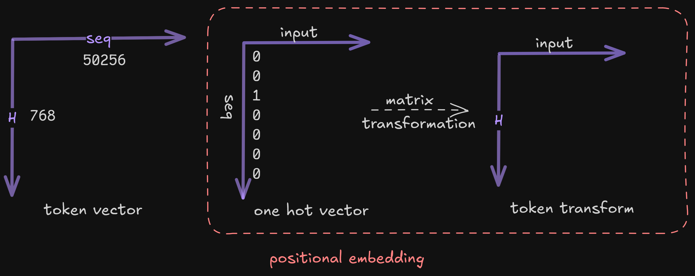

# Model Architecture

Convert token IDs into a 768-dimensional embedding space:

1. **Token Vector $x$**:
     - These are integer token IDs.
     - Vocabulary size is 50,257 (indexed from 0 to 50,256).
     - Each input text is tokenized into a sequence of these IDs.
     - Each token ID is mapped to an

2. **Sequence Length (up to 1024 elements)**:
     - Maximum context window of 1024 tokens.
     - This means the input sequence $x$ is a vector of up to 1024 token IDs.

**Example:**

```c
x = {15496, 11, 475, 645, 284, ...}
```
<div align="center">



</div>

1. one hot vector $O_h$ has dimension = N(vocab)

2. embedding space: $H$

3. transform input into $H$

>[!NOTE]
>Row dimensionality of the input is N(seq) in positional embedding

$$
\begin{align*}
   Norm(x) &= \dfrac{x_i-\mu}{\sqrt{\sigma^2}} \\
   
   \sigma^2 &= \dfrac{\Sigma(x_i-\mu)^2}{H} \\
   
   \mu &= \dfrac{\Sigma(x_i)}{H}
\end{align*}
$$