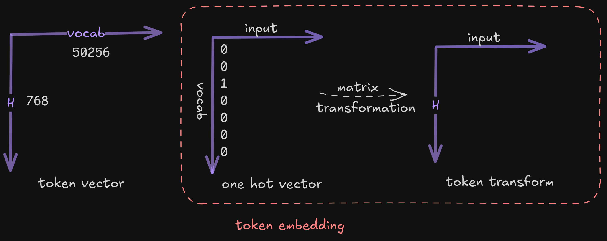

# Model Architecture

To convert token IDs into a 768-dimensional embedding space:

1. **Token Vector $x$**:
     - These are integer token IDs.
     - Vocabulary size is 50,257 (indexed from 0 to 50,256).
     - Each input text is tokenized into a sequence of these IDs.

2. **Sequence Length (up to 1024 elements)**:
     - Maximum context window of 1024 tokens.
     - This means the input sequence $x$ is a vector of up to 1024 token IDs.

**Example:**

```c
x = {15496, 11, 475, 645, 284, ...}
```
<div align="center">



</div>